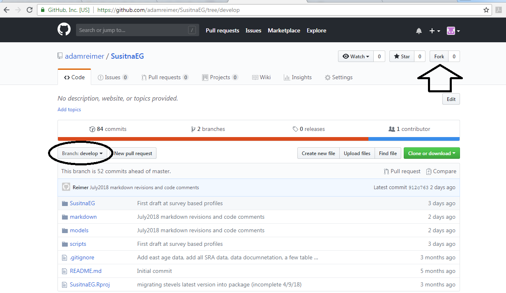
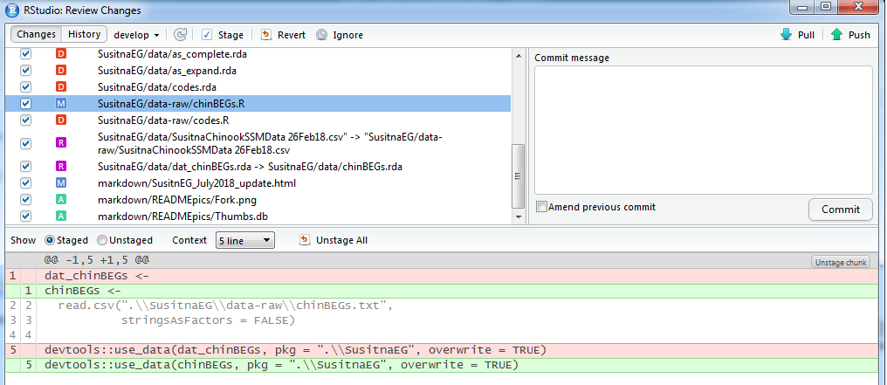
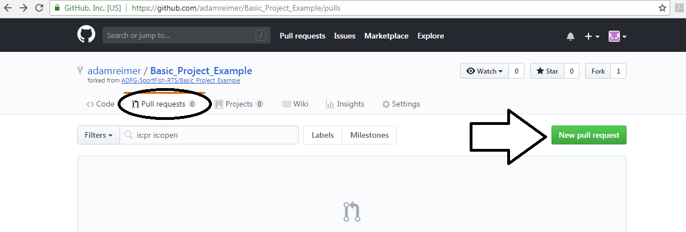

# SusitnaEG
***

This repository contains the Susitna River spawn-recruit analysis conducted by the Alaska Department of Fish and Game. The repository is organized as follows:
  
* __SusitnaEG__ A package with data and R code for preparing the analysis and summarizing the results.
    + The package contains the project data and functions that necessary to prepare the analysis and examine the results. R help files are written for all of the function and their use is demonstrated in 'script_SuChin.r' and 'SusitnaEG_July2018_update.md'. 
* __markdown__ Markdown files and associated output for various summaries and updates.
* __models__ Rjags model code. The working file is 'mod_SuChin.r'.
* __scripts__ R scripts to run the analysis. The working file is 'script_SuChin.r'.

## To reveiw this analysis
***
### Static collaboration
Press the green "clone or download" button followed by the "download ZIP" button. Open the zip file, extract the results and double click the file "SusitnaEG.Rproj". Email me questions, comments or concerns.

### Active collaboration
This method has some overhead but has advantages that outweigh the costs. You will need do some installation, try reading the first two sections of this guide (http://happygitwithr.com/rstudio-see-git.html). 

1. Fork the development branch of my repository onto your GitHub account.

    
2. In your newly created repository copy the URL (green button labeled 'clone or download' followed by the copy symbol next to the URL).
  
3. In RStudio navigate to File > New Project > Version Control > Git and:
    + Paste the URL under 'repository URL' (The directory name will auto-fill)
    + Pick a location for the directory
  
4. Run the script, look at the code and results. If you see an, error fix it! If you know a better way, try it!
  
5. Save the files you have modified. Don't rename anything just save it.

8. Check out the Git pane. Changed files will be listed there. Stage them (staging just means to track them using Git) by checking the box next to each file.
  
9. Press the commit button (A commit is a snapshot of the project. In this case it is a snapshot after you have made some corrections or modifications). A new window will open summarizing your commit.

In this example the files with red boxes were deleted, the files with purple boxes were renamed, the files with green boxes were added and the file with a blue box was modified. The modifications can be seen below (the old code is in pink, the new code is in green). Add a commit message explaining the changes in general terms and press the commit button.
  
9. You can repeat the modify-stage-commit process as many times as you would like. When you are finished you can push your work back to GitHub (Green Arrow in Rstudio). Pushing applies the changes you have made in the local repository (your computer's hard drive) to your remote repository (stored on GitHub).
  
10. Go back to GitHub and your SusitnaEG repository. Your changes should be visible. Go to the "Pull Requests" tab and press the green "New Pull Request" button (A Pull request is a way for you to let me know that you have made some improvements and you would like me to consider adding them to the analysis). A summary of your changes will appear. Submit the request and thanks in advance!

