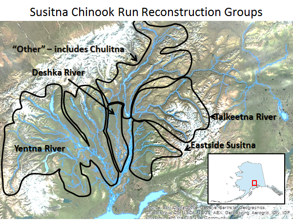

```{r setup, include=FALSE}
knitr::opts_chunk$set(echo = FALSE, warning = FALSE, fig.cap = TRUE, fig.align = 'center')
library(SusitnaEG)
get_ids()
post <- readRDS("..\\..\\posts\\SuChinook_DsumS_ababd3a.rds")
goals_list <- list(Deshka = c(10000, 11000),
                   Eastside = c(10000, 11000),
                   Talkeetna = c(10000, 11000),
                   Yentna = c(10000, 11000))
```



```{r, fig.height = 8, fig.width = 10, fig.cap = "Figure 2.- Escapement and Inriver run abundance (black lines show the median while shaded areas show 95% credibility intervals) of Deshka River Chinook salmon as reconstructed from aerial survey counts, weir counts, and capture-recapture estimates. For plotting, aerial survey counts were expanded by the inverse of survey detectability. Points are jittered along the x-axis."}
fit <- lapply(stock_id[-5], plot_fit, post_dat = post)
fit[[1]]
```

```{r, fig.width = 7, fig.height = 9, fig.cap = "Figure 3.- Point estimates (posterior medians; solid lines) and 95% credibility intervals (shaded areas) of spawning escapement, total run abundance, recruitment by brood year, harvest rate, and Ricker productivity residuals from a state-space model of Deshka River Chinook salmon, 1979-2017. Posterior medians of $S_{MSY}$ and $U_{MSY}$ are plotted as short dash horizontal reference lines while posterior medians of $S_{MSR}$ and $U_{MSR}$ are plotted as long dash horizontal reference lines."}
state <- lapply(stock_id[-5], function(x) plot_state(post, stock = x, rp = c("msy", "msr")))
state[[1]]
```

```{r, fig.width = 7, fig.height = 7, fig.cap = "Figure 4.- Plausible spawner-recruit relationships for Deshka River Chinook salmon, as derived from an age-structured state-space model fitted to abundance, harvest, and age data for 1979-2014. Posterior means of R and S are plotted as brood year labels with 95% credibility intervals plotted as light dashed lines. The heavy dashed line is the Ricker relationship constructed from ln($\\alpha\\prime$) and $\\beta$ posterior medians. Ricker relationships are also plotted (light grey lines) for 40 paired values of ln($\\alpha\\prime$) and $\\beta$ sampled from the posterior probability distribution, representing plausible Ricker relationships that could have generated the observed data. Recruits replace spawners (R = S) on the diagonal line."}
horse <- lapply(stock_id[-5], plot_horse, post_dat = post)
horse[[1]]
```

```{r, fig.width = 8, fig.height = 8, fig.cap = "Figure 5.- Optimal yield profiles for Deshka River Chinook salmon. OYPs show probability that a specified spawning abundance will result in specified fractions (70%, 80%, and 90% line) of maximum sustained yield. Shaded areas bracket the existing goal range; grey and black marks along the x-axis show comparable lower and upper bounds for other Alaskan Chinook salmon stocks scaled by $S_{MSY}$ ratios (see Methods)."}
profiles <- lapply(stock_id[-5], get_profile, post_dat = post)
profile <- mapply(plot_profile, 
                  profile_dat = profiles, 
                  goal_range = goals_list, 
                  MoreArgs = list(limit = 30000), 
                  SIMPLIFY = FALSE)
profile[[1]]
```

```{r fig.width = 7, fig.height = 5, fig.cap = "Figure 6.- Expected sustained yield plots for Deshka River Chinook salmon. ESY median (solid black line), and 50% interval (shaded area around the line) assume average productivity for brood years 1979-2014. The grey and black marks along the x-axis show comparable lower and upper bounds for other Alaskan Chinook salmon stocks scaled by $S_{MSY}$ ratios (see Methods)."}
ey <- mapply(plot_ey, profile_dat = profiles, goal_range = goals_list, SIMPLIFY = FALSE)
ey[[1]]
```

```{r, fig.height = 8, fig.width = 10, fig.cap = "Figure 7.- Escapement and Inriver run abundance (black lines show the median while shaded areas show 95% credibility intervals) of East Susitna Chinook salmon as reconstructed from aerial survey counts, weir counts, and capture-recapture estimates. For plotting, aerial survey counts were expanded by the inverse of the product of survey detectability and stock composition while weir counts were expanded by the inverse of stock composition. Points are jittered along the x-axis."}
fit[[2]]
```

```{r, fig.width = 8, fig.height = 9, fig.cap = "Figure 8.- Estimated stock composition estimates by calendar year from the state-space model fitted to data from Susitna River Chinook salmon. Each panel is an area graph, in which distance between lines represent stock composition proportions. Dots are telemetry-based estimates of stock composition."}
plot_stock(telemetry, post)
```

```{r, fig.width = 7, fig.height = 9, fig.cap = "Figure 9.- Point estimates (posterior medians; solid lines) and 95% credibility intervals (shaded areas) of spawning escapement, total run abundance, recruitment by brood year, harvest rate, and Ricker productivity residuals from a state-space model of East Susitna Chinook salmon, 1979-2017. Posterior medians of $S_{MSY}$ and $U_{MSY}$ are plotted as short dash horizontal reference lines while posterior medians of $S_{MSR}$ and $U_{MSR}$ are plotted as long dash horizontal reference lines."}
state[[2]]
```

```{r, fig.width = 7, fig.height = 7, fig.cap = "Figure 10.- Plausible spawner-recruit relationships for East Susitna Chinook salmon, as derived from an age-structured state-space model fitted to abundance, harvest, and age data for 1979-2014. Posterior means of R and S are plotted as brood year labels with 95% credibility intervals plotted as light dashed lines. The heavy dashed line is the Ricker relationship constructed from ln($\\alpha\\prime$) and $\\beta$ posterior medians. Ricker relationships are also plotted (light grey lines) for 40 paired values of ln($\\alpha\\prime$) and $\\beta$ sampled from the posterior probability distribution, representing plausible Ricker relationships that could have generated the observed data. Recruits replace spawners (R = S) on the diagonal line."}
horse[[2]]
```

```{r, fig.width = 8, fig.height = 8, fig.cap = "Figure 11.- Optimal yield profiles for East Susitna Chinook salmon. OYPs show probability that a specified spawning abundance will result in specified fractions (70%, 80%, and 90% line) of maximum sustained yield. Shaded areas bracket the existing goal range; grey and black marks along the x-axis show comparable lower and upper bounds for other Alaskan Chinook salmon stocks scaled by $S_{MSY}$ ratios (see Methods)."}
profile[[2]]
```

```{r fig.width = 7, fig.height = 5, fig.cap = "Figure 12.- Expected sustained yield plots for East Susitna River Chinook salmon. ESY median (solid black line), and 50% interval (shaded area around the line) assume average productivity for brood years 1973-2014. The grey and black marks along the x-axis show comparable lower and upper bounds for other Alaskan Chinook salmon stocks scaled by $S_{MSY}$ ratios (see Methods)."}
ey[[2]]
```

```{r, fig.height = 8, fig.width = 10, fig.cap = "Figure 13.- Escapement and Inriver run abundance (black lines show the median while shaded areas show 95% credibility intervals) of Talkeetna Drainage Chinook salmon as reconstructed from aerial survey counts and capture-recapture estimates. For plotting, aerial survey counts were expanded by the inverse of the product of survey detectability and stock composition. Points are jittered along the x-axis.."}
fit[[3]]
```

```{r, fig.width = 7, fig.height = 9, fig.cap = "Figure 14.- Point estimates (posterior medians; solid lines) and 95% credibility intervals (shaded areas) of spawning escapement, total run abundance, recruitment by brood year, harvest rate, and Ricker productivity residuals from a state-space model of Talkeetna drainage Chinook salmon, 1979-2017. Posterior medians of $S_{MSY}$ and $U_{MSY}$ are plotted as short dash horizontal reference lines while posterior medians of $S_{MSR}$ and $U_{MSR}$ are plotted as long dash horizontal reference lines."}
state[[3]]
```

```{r, fig.width = 7, fig.height = 7, fig.cap = "Figure 15.- Plausible spawner-recruit relationships for Talkeetna drainage Chinook salmon, as derived from an age-structured state-space model fitted to abundance, harvest, and age data for 1979-2014. Posterior means of R and S are plotted as brood year labels with 95% credibility intervals plotted as light dashed lines. The heavy dashed line is the Ricker relationship constructed from ln($\\alpha\\prime$) and $\\beta$ posterior medians. Ricker relationships are also plotted (light grey lines) for 40 paired values of ln($\\alpha\\prime$) and $\\beta$ sampled from the posterior probability distribution, representing plausible Ricker relationships that could have generated the observed data. Recruits replace spawners (R = S) on the diagonal line."}
horse[[3]]
```

```{r, fig.width = 8, fig.height = 8, fig.cap = "Figure 16.- Optimal yield profiles for Talkeetna drainage Chinook salmon. OYPs show probability that a specified spawning abundance will result in specified fractions (70%, 80%, and 90% line) of maximum sustained yield. Shaded areas bracket the existing goal range; grey and black marks along the x-axis show comparable lower and upper bounds for other Alaskan Chinook salmon stocks scaled by $S_{MSY}$ ratios (see Methods)."}
profile[[3]]
```

```{r fig.width = 7, fig.height = 5, fig.cap = "Figure 17.- Expected sustained yield plots for Talkeetna drainage Chinook salmon. ESY median (solid black line), and 50% interval (shaded area around the line) assume average productivity for brood years 1979-2014. The grey and black marks along the x-axis show comparable lower and upper bounds for other Alaskan Chinook salmon stocks scaled by $S_{MSY}$ ratios (see Methods)."}
ey[[3]]
``` 


```{r, fig.height = 8, fig.width = 10, fig.cap = "Figure 18.- Escapement and Inriver run abundance (black lines show the median while shaded areas show 95% credibility intervals) of Yentna Drainage Chinook salmon as reconstructed from aerial survey counts and capture-recapture estimates. For plotting, aerial survey counts were expanded by the inverse of the product of survey detectability and stock composition. Points are jittered along the x-axis."}
fit[[4]]
```

```{r, fig.width = 7, fig.height = 9, fig.cap = "Figure 19.- Point estimates (posterior medians; solid lines) and 95% credibility intervals (shaded areas) of spawning escapement, total run abundance, recruitment by brood year, harvest rate, and Ricker productivity residuals from a state-space model of Yentna Drainage Chinook salmon, 1979-2017. Posterior medians of $S_{MSY}$ and $U_{MSY}$ are plotted as short dash horizontal reference lines while posterior medians of $S_{MSR}$ and $U_{MSR}$ are plotted as long dash horizontal reference lines."}
state[[4]]
```

```{r, fig.width = 7, fig.height = 7, fig.cap = "Figure 20.- Plausible spawner-recruit relationships for Yentna River Chinook salmon, as derived from an age-structured state-space model fitted to abundance, harvest, and age data for 1979-2014. Posterior means of R and S are plotted as brood year labels with 95% credibility intervals plotted as light dashed lines. The heavy dashed line is the Ricker relationship constructed from ln($\\alpha\\prime$) and $\\beta$ posterior medians. Ricker relationships are also plotted (light grey lines) for 40 paired values of ln($\\alpha\\prime$) and $\\beta$ sampled from the posterior probability distribution, representing plausible Ricker relationships that could have generated the observed data. Recruits replace spawners (R = S) on the diagonal line."}
horse[[4]]
```

```{r, fig.width = 8, fig.height = 8, fig.cap = "Figure 21.- Optimal yield profiles for Yentna River Chinook salmon. OYPs show probability that a specified spawning abundance will result in specified fractions (70%, 80%, and 90% line) of maximum sustained yield. Shaded areas bracket the existing goal range; grey and black marks along the x-axis show comparable lower and upper bounds for other Alaskan Chinook salmon stocks scaled by $S_{MSY}$ ratios (see Methods)."}
profile[[4]]
```

```{r fig.width = 7, fig.height = 5, fig.cap = "Figure 22.- Expected sustained yield plots for Yentna River Chinook salmon. ESY median (solid black line), and 50% interval (shaded area around the line) assume average productivity for brood years 1979-2014. The grey and black marks along the x-axis show comparable lower and upper bounds for other Alaskan Chinook salmon stocks scaled by $S_{MSY}$ ratios (see Methods)."}
ey[[4]]
```

```{r, fig.width = 8, fig.height = 9, fig.cap = "Figure 23.- Estimated age-at-maturity proportions by brood year (top), age composition proportions by calendar year (middle), and total run by age (bottom), from the state-space model fitted to data from Susitna River Chinook salmon. Top and middle are area graphs, in which distance between lines represent age proportions. Dots in middle plot are data-based estimates of age composition."}
plot_age(post)
```
