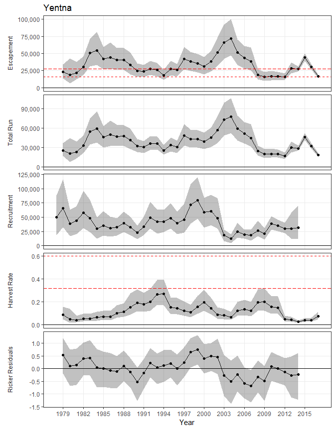
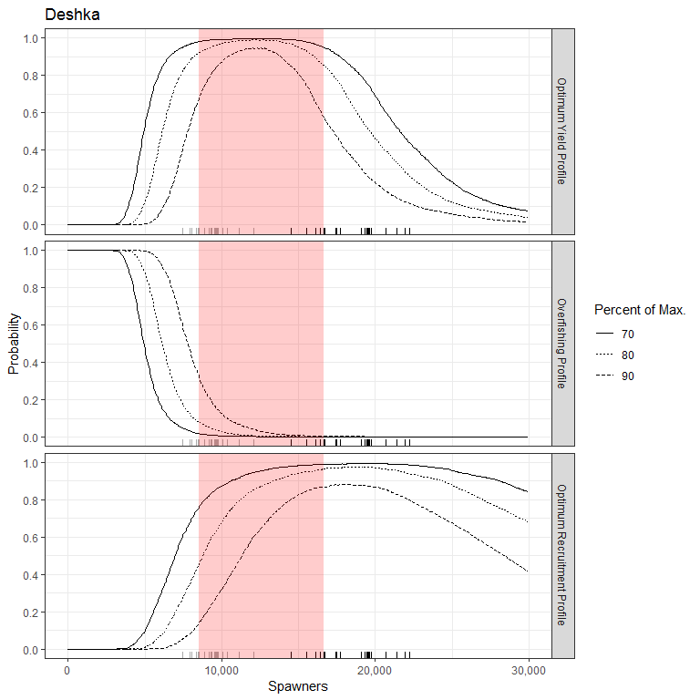

This update includes revised telemetry and mark-recapture data.

## Run Reconstruction component
Our model estimates historic abundance of Susitna River Chinook salmon in 5 geographically distinct stock groups that coincide with sport fishing management areas. Annual abundance in each stock group is reconstructed from a combination of mark-recapture abundance estimates for each stock group, aerial survey data for individual tributaries within each stock group and weir counts for individual tributaries within each stock group. The annual run sizes in each stock group are modeled independently, although some data and parameters are shared or assumed to be related. 
  
### Run Reconstruction by Stock Group
#### Deshka River
The Deshka River Chinook salmon escapement is informed by annual single aerial surveys through 1994 and by annual weir counts and sporatic single aerial surveys after 1994 (Figure 1). Aerial surveys deviate moderately from weir counts when both are available. Runs were large prior to 1991 underwent a decline during 1991-1994, rebounded during 1997-2004 declined again staring in 2005 and remained at a lower level during 2008-2017. Estimates of abundance are very imprecise prior to 1995, when weir counts became available.

Figure 1.- Escapement and Inriver run abundance (black lines show the median while shaded areas show 95% credibility intervals) of Deshka River Chinook salmon as reconstructed from aerial survey counts, weir counts, and capture-recapture estimates. For plotting, aerial survey counts were expanded by the inverse of survey detectability. Points are jittered along the x-axis.

***
Total run estimates (Figure 2 second panel) are marginally more precisely than escapement estimates because harvest is relatively well estimated. Coefficients of variation for total run are generally greater than 0.2 prior to 1995 and less than 0.1 after 1995. Coefficients of variation for recruitment (Figure 2 third panel) were larger (0.1 – 0.4) presumably because stock specific age composition data is unavailable and there is considerable variation around the stock-recruit relationship. Harvest rates for Deshka River Chinook salmon have been below levels that would maximize yield but have approached levels that would maximize recruitment during 1991-1993 and again during 2006-2008 (Figure 2 fourth panel).

Figure 2.- Point estimates (posterior medians; solid lines) and 95% credibility intervals (shaded areas) of spawning escapement, total run abundance, recruitment by brood year, harvest rate, and Ricker productivity residuals from a state-space model of Deshka River Chinook salmon, 1979-2017. Posterior medians of $S_{MSY}$ and $U_{MSY}$ are plotted as short dash horizontal reference lines while posterior medians of $S_{MSR}$ and $U_{MSR}$ are plotted as long dash horizontal reference lines.

***
#### East Susitna Tributaries
Measures of Chinook salmon abundance in the East Susitna stock group exhibit common trends through time, and reconstructed estimates of abundance generally pass through the center of the scaled individual measures (Figure 3). Aerial surveys are flown on six tributaries within this stock group and weirs have been operated on individual tributaries in 5 years. During 2015, aerial surveys indicated a smaller abundance that estimated by the mark-recapture although the estimated inriver run still fell within the 95% CI of the mark recapture estimate. Runs were small prior to 1983 increased during 1983-1997, underwent a decline during 1998-2012, and rebounded slightly after 2012. Estimates of abundance are relatively precise throughout the time series.

Figure 3.- Escapement and Inriver run abundance (black lines show the median while shaded areas show 95% credibility intervals) of East Susitna Chinook salmon as reconstructed from aerial survey counts, weir counts, and capture-recapture estimates. For plotting, aerial survey counts were expanded by the inverse of the product of survey detectability and stock composition while weir counts were expanded by the inverse of stock composition. Points are jittered along the x-axis.

***
Total run estimates (Figure 4 second panel) are more precisely than escapement estimates because harvest is relatively well estimated. Coefficients of variation for total run are generally less than 0.15. Coefficients of variation for recruitment (Figure 4 middle panel) were generally less than 20% except at the beginning and end of the data series, when one or more age classes were missing.  Harvest rates for East Susitna Chinook salmon approached levels that would maximize yield during 1992-1994 and have been close to levels that would maximize recruitment during 1986-1991 and again during 1995-2008 (Figure 4 fourth panel).

Figure 4.- Point estimates (posterior medians; solid lines) and 95% credibility intervals (shaded areas) of spawning escapement, total run abundance, recruitment by brood year, harvest rate, and Ricker productivity residuals from a state-space model of East Susitna Chinook salmon, 1979-2017. Posterior medians of $S_{MSY}$ and $U_{MSY}$ are plotted as short dash horizontal reference lines while posterior medians of $S_{MSR}$ and $U_{MSR}$ are plotted as long dash horizontal reference lines.

***
#### Talkeetna Drainage
Measures of Talkeetna River Chinook salmon abundance exhibited common trends through time, and reconstructed estimates of run abundance generally passed through the center of the scaled individual measures (Figure 5). Aerial surveys are flown on only two tributaries within this stock group. During 2013, aerial survey counts indicated a smaller abundance that estimated by the mark-recapture although the 95% CI of inriver run and the mark recapture estimate overlap. Runs increased during 1979-1988, underwent a decline during 1989-1994, increased during 1995-1997 and generally declined thereafter. Estimates of abundance have moderate precision throughout the time series.

Figure 5.- Escapement and Inriver run abundance (black lines show the median while shaded areas show 95% credibility intervals) of Talkeetna Drainage Chinook salmon as reconstructed from aerial survey counts and capture-recapture estimates. For plotting, aerial survey counts were expanded by the inverse of the product of survey detectability and stock composition. Points are jittered along the x-axis..

***
Total run estimates (Figure 6 second panel) are marginally more precisely than escapement estimates because harvest is relatively well estimated. Coefficients of variation for total run are generally less than 0.20. Coefficients of variation for recruitment were larger (20-40%) presumably because stock specific age composition data is unavailable and there is considerable variation around the stock-recruit relationship. Harvest rates for Talkeetna Chinook salmon have been far below levels that would maximize yield but have been near levels that would maximize recruitment for most of the time series (Figure 6 fourth panel).

Figure 6.- Point estimates (posterior medians; solid lines) and 95% credibility intervals (shaded areas) of spawning escapement, total run abundance, recruitment by brood year, harvest rate, and Ricker productivity residuals from a state-space model of Talkeetna drainage Chinook salmon, 1979-2017. Posterior medians of $S_{MSY}$ and $U_{MSY}$ are plotted as short dash horizontal reference lines while posterior medians of $S_{MSR}$ and $U_{MSR}$ are plotted as long dash horizontal reference lines.

***
#### Yentna Drainage
Aerial surveys are flown on four tributaries within the Yentna River stock group and only 4 years of mark recapture abundance estimates are available. Two surveys exhibit a common trend through time while two surveys are poorly correlated (Figure 7). During 2014, aerial survey counts indicated a larger abundance that estimated by the mark-recapture although the 95% CI of inriver run and the mark recapture estimate overlap. Runs increased during 1979-1984, decreased during 1985-1994, increased again during 1995-2004, decreased again during 2005-2012 and were variable during 2013-2017. Estimates of abundance have moderate precision throughout the time series.

Figure 7.- Escapement and Inriver run abundance (black lines show the median while shaded areas show 95% credibility intervals) of Yentna Drainage Chinook salmon as reconstructed from aerial survey counts and capture-recapture estimates. For plotting, aerial survey counts were expanded by the inverse of the product of survey detectability and stock composition. Points are jittered along the x-axis.

***
Total run estimates (Figure 8 second panel) are slightly more precisely than escapement estimates because harvest is relatively well estimated. Coefficients of variation for total run are generally less than 0.15. Coefficients of variation for recruitment (Figure 8 middle panel) were less than 30% except at the beginning and end of the data series, when one or more age classes were missing.  Harvest rates for Yentna Chinook salmon have been well below levels that would maximize yield but have approached levels that would maximize recruitment during 1993-1994 (Figure 8 fourth panel).

Figure 8.- Point estimates (posterior medians; solid lines) and 95% credibility intervals (shaded areas) of spawning escapement, total run abundance, recruitment by brood year, harvest rate, and Ricker productivity residuals from a state-space model of Yentna Drainage Chinook salmon, 1979-2017. Posterior medians of $S_{MSY}$ and $U_{MSY}$ are plotted as short dash horizontal reference lines while posterior medians of $S_{MSR}$ and $U_{MSR}$ are plotted as long dash horizontal reference lines.

***
### Age composition
Age composition data is inconsistently available for individual stock groups within the Susitna River drainage. Prior to 1985 age data is available from creel surveys of fisheries within several stock groups and from fishwheel/carcass surveys in both the Susitna and Yentna drainages. During 1986-1994 age data is available from creel surveys of fisheries in the Deshka, East Susitna and Talkeetna stock groups. During 1994-2002 age data is available from creel surveys of fisheries in East Susitna and Talkeetna stock groups and from weirs in the Deshka and East Susitna stock groups. After 2002, age data is only available from the Deshka River weir. Because stock specific age data was not available throughout the time series we made inference on the age composition of all fish returning the Susitna River drainage after adjusting the observed age composition for sampling program. Weir data were considered unbiased while the mean response for creel and fishwheel/carcass survey data were considered biased.
  
Susitna River Chinook salmon were composed primarily of age-4 (1.2), age-5 (1.3) and age-6 (1.4) fish (Figure 9 middle and bottom panels). Chinook salmon matured at age-3 (0-0.13), age-4 (0.08-0.45), age-5 (0.22-0.63), and age-6 (0.05-0.33); Figure 9 top panel). Chinook salmon trended toward earlier maturation during the 1972-2014 brood years.

Figure 9.- Estimated age-at-maturity proportions by brood year (top), age composition proportions by calendar year (middle), and total run by age (bottom), from the state-space model fitted to data from Susitna River Chinook salmon. Top and middle are area graphs, in which distance between lines represent age proportions. Dots in middle plot are data-based estimates of age composition.

***
### Stock Composition
The relative contribution of each spawning tributary within a stock group is required to relate tributary-specific aerial survey counts to stock-specific estimated spawning abundance. Stock composition is estimated directly from radio tag data and indirectly from aerial survey data. Model estimated stock composition was generally in agreement with empirical stock composition estimates (from radio tag data) but occasionally diverged when opposed by relative aerial survey counts. The model allows mean stock composition to trend through time with annual variability around the trending mean.
  
Surveyed tributaries comprised 0.82-0.99 of the spawning abundance within the East Susitna stock group (Figure 10 top panel). Little Willow Creek (0.12-0.25) and Willow/Deception Creeks (0.18-0.45) were the largest spawning tributaries with the contribution of both stocks increasing through the time series. Goose Creek (0.01-0.11), Kashwitna River (0.05-0.13), Montana Creek (0.08-0.18) and Sheep Creek (0.08-0.18) are smaller spawning tributaries with the contribution of these stocks decreasing through the time series.
  
Surveyed tributaries comprised 0.56-0.74 of the spawning abundance within the Talkeetna stock group (Figure 10 second panel). Clear Creek (0.21-0.42) and Prairie Creeks (0.22-0.53) were similar sized components of the stock group with Clear Creek increasing in relative contribution through the time series.
  
Surveyed tributaries comprised 0.5-0.55 of the spawning abundance within the Yentna stock group (Figure 10 third panel). Lake Creek (0.22-0.31) and Talachulitna River (0.12-0.21) were the largest spawning tributaries with the contribution of both stocks stable through the time series. Cache Creek (0.01-0.05) was a smaller spawning tributary with the contribution decreasing through the time series. Peters Creek (0.03-0.12) was a medium sized spawning tributary with the contribution increasing through the time series.

Figure 10.- Estimated stock composition estimates by calendar year from the state-space model fitted to data from Susitna River Chinook salmon. Each panel is an area graph, in which distance between lines represent stock composition proportions. Dots are telemetry-based estimates of stock composition.

***
### Aerial Survey Detectability
Aerial survey detectability is the fraction of the annual spawning abundance observed during a single aerial survey. Detectability of spawning Chinook salmon within each surveyed spawning tributary is required to relate aerial survey counts to spawning abundance. Detectability is assumed constant through time. Detectability varied between 0.24-0.67% (Figure 11) and roughly approximated the mean of empirical estimates of detectability in situations where weir and aerial survey data exist for the same tributary.

Figure 11.- Estimated aerial survey detectability by tributary from the state-space model fitted to data from Susitna River Chinook salmon. Dots are estimates of annual detectability when aerial survey and weir data exist tor the same tributary.

***
## Stock-Recruit relationships
It seems easier to talk about the possible goal ranges with some concrete examples as a starting point. Currently, lower goal bounds in Alaska range from 0.62-0.99 of $S_{msy}$ while upper bounds range from 1.2-1.83 of $S_{msy}$. I’ll use these percentages to create some straw dog goals mostly so the graphics are informative. The plotted Deshka goal range is at the 25th percentile, or fairly liberal, relative to other goals throughout the state. The plotted East Susitna goal range is at the 95th percentile, or very conservative, relative to other goals throughout the state. The plotted Talkeetna/Yenta goal ranges are at the 75th percentile.
  
***

        Lower bound/Smsy   Upper bound/Smsy
-----  -----------------  -----------------
0%                  0.62               1.20
25%                 0.70               1.37
50%                 0.78               1.59
75%                 0.80               1.62
95%                 0.92               1.80
100%                0.99               1.83

stock                  lb         ub
-------------  ----------  ---------
Deshka           8496.486   16628.84
East Susitna    11793.935   23075.09
Talkeetna        8482.839   17177.75
Yentna          12892.762   26107.84
  
***
### Deshka River
Estimates of population parameters from the state-space model take the measurement errors in escapement S and recruitment R (Figure 12 error bars) into account. The individual data pairs are weighted differentially, depending upon the certainty with which the individual values of S and R are known. Because measurement error is substantial for many brood years, and due to other sources of uncertainty, Ricker SR relationships that could have plausibly generated the observed data are diverse (Figure 12: light lines), often deviating substantially from the median Ricker relationship (Figure 12: heavy dashed line).

Figure 12.- Plausible spawner-recruit relationships for Deshka River Chinook salmon, as derived from an age-structured state-space model fitted to abundance, harvest, and age data for 1979-2014. Posterior medians of R and S are plotted as brood year labels with 90% credibility intervals plotted as light dashed lines. The heavy dashed line is the Ricker relationship constructed from ln($\alpha$) and $\beta$ posterior medians. Ricker relationships are also plotted (light grey lines) for 40 paired values of ln($\alpha$) and $\beta$ sampled from the posterior probability distribution, representing plausible Ricker relationships that could have generated the observed data. Recruits replace spawners (R = S) on the diagonal line.

***
Median productivity (recruits per spawner, in the absence of density effects) of Deshka River Chinook salmon during 1979–2014 has been moderate ($\textrm{ln}(\alpha)$=1.42; Table 1). There is a great deal of uncertainty about $\textrm{ln}(\alpha)$ (95% CI = 0.63-2.4), as evident in the extent to which the plausible SR relationships differ with respect to their slope at $S$ = 0. Similarly, uncertainty about $\beta$ as reflected in variability in the values of $S$ leading to maximum recruitment $S_{MSR}=\frac{1}{\beta}$, and uncertainty about equilibrium abundance $S_{EQ}$ is reflected by variability in the values of $S$ where the curves intersect the replacement line. There is considerable variation around the Ricker estimated mean ($\sigma_w$=0.66).
  
The Ricker recruitment residuals in Figure 2 (bottom panel) are deviations in recruitment of Deshka River Chinook salmon from that predicted by the Ricker SR relationship, reflecting time-varying changes in productivity after controlling for density-dependent effects. Deshka Chinook had high productivity through the 1986 brood year, experienced a sharp decline declined during 1987-1991, remained slightly above average through 2001 and has remained at or below average since. Model residuals are positively correlated supporting the concept of time-varying productivity ($\phi$=0.47).
  
There was a moderate amount of variability around age-at-maturity proportions ($D_{age}$=25) amongst brood years. Because age-at-maturity is estimated for the entire Susitna River drainage this value is identical for each stock group.
  
***
Table 1.- State-space model parameter estimates for Deshka River Chinook salmon, calendar years 1979-2017. Posterior medians are point estimates while 95% credibility intervals are shown in parentheses. Parameter definitions are in the Methods section. 

       Parameter                median(95% CI)
----------------  ----------------------------
    ln($\alpha$)             1.42 (0.63 - 2.4)
         $\beta$   5.4e-05 (2.7e-05 - 8.8e-05)
          $\phi$        0.47 (-1.5e-01 - 0.88)
    $\sigma_{w}$            0.66 (0.44 - 1.04)
 $\sigma_{weir}$            0.10 (0.09 - 0.12)
       $D_{age}$            25.0 (17.5 - 32.6)
       $S_{MSR}$      18,645 (11,359 - 37,355)
        $S_{EQ}$      32,531 (23,920 - 52,714)
       $S_{MSY}$       12,138 (8,741 - 19,711)
       $U_{MSY}$            0.66 (0.43 - 0.85)
  
Sustained yield is the number of fish in the expected recruitment over and above that needed to replace the spawners. Escapement goals in Alaska are developed to maximize sustained yield by choosing a range of escapements around $S_{MSY}$, the theoretical number of spawners that will result in the largest difference between recruitment and replacement. Given the diversity of plausible SR relationships (Figure 12), it is important to choose an escapement goal that is robust to this uncertainty rather than one tailored solely to the median SR relationship. To address this uncertainty we tallied the success or failure of a given number of spawners to achieve biological reference points across plausible SR relationships.
  
Deshka River Chinook salmon escapement leading to maximum sustained yield $S_{MSY}$ was estimated to be between 8,741 and 19,711 (posterior median 12,138, CV 0.25; Table 1). The optimal yield profiles in Figure 13 (top panel) show the probability of a given number of spawners achieving 70%, 80%, and 90% of MSY. These probabilities, which are highest near $S_{MSY}$ can be used to quantify the yield performance of prospective escapement goals (Figure 12 shaded areas), taking into consideration all of the uncertainty about the true abundance and productivity of the stock. The overfishing profiles (Figure 13 middle panel) show the probability that sustained yield would be reduced to less than 70%, 80%, or 90% of MSY by fishing too hard and supplying too few spawners. For this stock, these probabilities are nearly the exact complements of the probabilities in the left-hand limbs of the optimal yield profiles. Expected sustained yield (number of fish over and above that necessary to replace the number of spawners, averaged over brood years 1979–2015) is also maximized at $S_{MSY}$ (Figure 14). The escapement goal shown has a 92% probability of achieving 80% of MSY at the lower bound and a 85% probability of achieving MSY at the upper bound.
  
Deshka River Chinook salmon have an existing goal range of 13,000-27,000 Chinook salmon. Escapements at the low end of the existing range have a 99% probability of producing a yield within 80% of MSY while escapements at the upper end of the existing range have a 6% probability of producing yields within 80% or MSY.
  
Fishery managers may want to evaluate existing and proposed goal ranges with respect the other indicators of fishery performance. In some sport fisheries run sizes and high catch rates are an important priority. Run size is associated with large recruitments. Escapement leading to maximum recruitment $S_{MSR}$ was estimated to be between 11,359 and 37,355 (posterior median 18,645, CV 0.37; Table 1). Analogous to the optimum yield profiles discussed above optimum recruitment profiles tally the success or failure of a given number of spawners to maximize recruitment across plausible SR relationships. The optimal recruitment profiles in Figure 13 (top panel) show the probability of a given number of spawners achieving 70%, 80%, and 90% of MSR. Optimum Recruitment probabilities, which are highest near $S_{MSR}$, reach maximums at larger spawning abundances that optimum yield probabilities and decrease more slowly as spawning abundance increases.

Figure 13.- Optimal yield profiles for Deshka River Chinook salmon. OYPs show probability that a specified spawning abundance will result in specified fractions (70%, 80%, and 90% line) of maximum sustained yield. Shaded areas bracket the existing goal range; grey and black marks along the x-axis show comparable lower and upper bounds for other Alaskan Chinook salmon stocks scaled by $S_{MSY}$ ratios (see Methods).

Figure 14.- Expected sustained yield plots for Deshka River Chinook salmon. ESY median (solid black line), and 50% interval (shaded area around the line) assume average productivity for brood years 1979-2014. The grey and black marks along the x-axis show comparable lower and upper bounds for other Alaskan Chinook salmon stocks scaled by $S_{MSY}$ ratios (see Methods).

***
### East Susitna Tributaries
The Ricker recruitment residuals in Figure 4 (bottom panel) are deviations in recruitment from that predicted by the Ricker SR relationship, reflecting time-varying changes in productivity after controlling for density-dependent effects. Residuals are highly positively correlated for the East Susitna stock group ($\phi$=0.8). East Susitna Chinook had above average productivity through the 2001 brood year, experienced a very sharp decline declined during 2002-2011, and returned to average after 2012. The sharp decline in productivity between 2002 and 2011 generally failed to replace themselves (Figure 15).

Figure 15.- Plausible spawner-recruit relationships for East Susitna Chinook salmon, as derived from an age-structured state-space model fitted to abundance, harvest, and age data for 1979-2014. Posterior medians of R and S are plotted as brood year labels with 90% credibility intervals plotted as light dashed lines. The heavy dashed line is the Ricker relationship constructed from ln($\alpha$) and $\beta$ posterior medians. Ricker relationships are also plotted (light grey lines) for 40 paired values of ln($\alpha$) and $\beta$ sampled from the posterior probability distribution, representing plausible Ricker relationships that could have generated the observed data. Recruits replace spawners (R = S) on the diagonal line.

***
Median productivity (recruits per spawner, in the absence of density effects) of East Susitna Chinook salmon during 1979–2014 has been low ($\textrm{ln}(\alpha)$=1.26; Table 2). There is a great deal of uncertainty about $\textrm{ln}(\alpha)$ (95% CI = 0.56-1.97; Table 2), as evident in the extent to which the plausible SR relationships differ with respect to their slope at $S$ = 0 (Figure 7). There is moderate variation around the Ricker estimated mean ($\sigma_w$=0.31).
  
The proportion of the East Susitna stock group covered by aerial surveys was highly variable amongst calendar years ($B_{survey}$=11.4). In contrast, stock composition of surveyed stocks within the East Susitna stock group was more stable ($D_{comp}$=117). 
  
***
Table 2.- State-space model parameter estimates for the East Susitna stock group, calendar years 1979-2017. Posterior medians are point estimates while coefficients of variation are shown in parentheses. Parameter definitions are in the Methods section.  

       Parameter                median(95% CI)
----------------  ----------------------------
    ln($\alpha$)            1.26 (0.56 - 1.97)
         $\beta$   4.3e-05 (1.6e-05 - 7.1e-05)
          $\phi$            0.80 (0.47 - 0.94)
    $\sigma_{w}$            0.31 (0.19 - 0.50)
 $\sigma_{weir}$            0.10 (0.09 - 0.12)
       $D_{age}$            25.0 (17.5 - 32.6)
      $D_{comp}$            117 (64.3 -   192)
    $B_{survey}$             11.4 (2.9 - 52.8)
       $S_{MSR}$      23,077 (13,992 - 63,457)
        $S_{EQ}$      32,261 (21,413 - 68,961)
       $S_{MSY}$       12,819 (8,736 - 27,309)
       $U_{MSY}$            0.56 (0.34 - 0.77)
  
East Susitna Chinook salmon escapement leading to maximum sustained yield $S_{MSY}$ was estimated to be between 8,736 and 27,309 (posterior median 12,819, CV 0.36; Table 2). The optimal yield profiles for the East Susitna stock group (Figure 16) reflect the conservative goal plotted, the goal range is shifted towards larger escapements relative to $S_{MSY}$. Expected yield of East Susitna Chinook salmon (Figure 17) would be sacrificed with the plotted goal. Escapement leading to maximum recruitment $S_{MSR}$ was estimated to be between 11,359 and 37,355 (posterior median 18,645, CV 0.37; Table 2). The escapement goal shown has a 94% probability of achieving 80% of MSY at the lower bound but only a 30% probability of achieving MSY at the upper bound. Conversely, the escapement goal shown has a 60% probability of achieving 80% of MSR at the lower bound and a 94% probability of achieving MSR at the upper bound.

Figure 16.- Optimal yield profiles for East Susitna Chinook salmon. OYPs show probability that a specified spawning abundance will result in specified fractions (70%, 80%, and 90% line) of maximum sustained yield. Shaded areas bracket the existing goal range; grey and black marks along the x-axis show comparable lower and upper bounds for other Alaskan Chinook salmon stocks scaled by $S_{MSY}$ ratios (see Methods).

Figure 17.- Expected sustained yield plots for East Susitna River Chinook salmon. ESY median (solid black line), and 50% interval (shaded area around the line) assume average productivity for brood years 1973-2014. The grey and black marks along the x-axis show comparable lower and upper bounds for other Alaskan Chinook salmon stocks scaled by $S_{MSY}$ ratios (see Methods).

***
### Talkeetna River drainage
Median productivity (recruits per spawner, in the absence of density effects) of Talkeetna River Chinook salmon during 1979–2015 has been lowest ($\textrm{ln}(\alpha)$=1.12; Table 3) of all Susitna River Chinook salmon stocks. There is a great deal of uncertainty about $\textrm{ln}(\alpha)$ (95% CI = 0.39-1.78; Table 3), as evident in the extent to which the plausible SR relationships differ with respect to their slope at $S$ = 0 (Figure 18). Low productivity is associated with smaller expected yields (Figure 18). There is considerable variation around the Ricker estimated mean ($\sigma_w$=0.68).
  
The Ricker recruitment residuals in Figure 6 (bottom panel) are deviations in recruitment from that predicted by the Ricker SR relationship, reflecting time-varying changes in productivity after controlling for density-dependent effects. Talkeetna Chinook had above average productivity through the 1985 brood year, near average productivity through the 2003 brood year and below average productivity thereafter. Residual correlation is negligible for the Talkeetna River Chinook salmon stock ($\phi$=0.23).

Figure 18.- Plausible spawner-recruit relationships for Talkeetna drainage Chinook salmon, as derived from an age-structured state-space model fitted to abundance, harvest, and age data for 1979-2014. Posterior medians of R and S are plotted as brood year labels with 90% credibility intervals plotted as light dashed lines. The heavy dashed line is the Ricker relationship constructed from ln($\alpha$) and $\beta$ posterior medians. Ricker relationships are also plotted (light grey lines) for 40 paired values of ln($\alpha$) and $\beta$ sampled from the posterior probability distribution, representing plausible Ricker relationships that could have generated the observed data. Recruits replace spawners (R = S) on the diagonal line.

***
Both the proportion of the Talkeetna River stock group that is covered by aerial surveys ($B_{survey}$=27.1) and stock composition of surveyed stocks within the Talkeetna River stock group ($D_{comp}$=35.4) have moderate variability around their central tendencies.
  
***
Table 3.- State-space model parameter estimates for Talkeetna drainage Chinook salmon, calendar years 1979-2017. Posterior medians are point estimates while coefficents of variation are shown in parentheses. Parameter definitions are in the Methods section.  

    Parameter                median(95% CI)
-------------  ----------------------------
 ln($\alpha$)            1.12 (0.39 - 1.78)
      $\beta$   5.3e-05 (2.2e-05 - 9.1e-05)
       $\phi$        0.23 (-4.9e-01 - 0.83)
 $\sigma_{w}$            0.68 (0.34 - 1.12)
    $D_{age}$            25.0 (17.5 - 32.6)
   $D_{comp}$            35.4 (18.0 - 86.8)
 $B_{survey}$            27.1 (3.7 -   703)
    $S_{MSR}$      19,036 (11,040 - 46,392)
     $S_{EQ}$      26,446 (18,100 - 45,578)
    $S_{MSY}$       10,604 (7,222 - 18,616)
    $U_{MSY}$            0.56 (0.32 - 0.75)
  
Escapement leading to maximum sustained yield $S_{MSY}$ was estimated to be between 7,222 and 18,616 (posterior median 10,604, CV 0.29; Table 3). Escapement leading to maximum recruitment $S_{MSR}$ was estimated to be between 11,359 and 37,355 (posterior median 18,645, CV 0.37; Table 3). The escapement goal shown has a 95% probability of achieving 80% of MSY at the lower bound and a 44% probability of achieving MSY at the upper bound. Conversely, the escapement goal shown has a 42% probability of achieving 80% of MSR at the lower bound and a 93% probability of achieving MSR at the upper bound.

Figure 19.- Optimal yield profiles for Talkeetna drainage Chinook salmon. OYPs show probability that a specified spawning abundance will result in specified fractions (70%, 80%, and 90% line) of maximum sustained yield. Shaded areas bracket the existing goal range; grey and black marks along the x-axis show comparable lower and upper bounds for other Alaskan Chinook salmon stocks scaled by $S_{MSY}$ ratios (see Methods).

Figure 20.- Expected sustained yield plots for Talkeetna drainage Chinook salmon. ESY median (solid black line), and 50% interval (shaded area around the line) assume average productivity for brood years 1979-2014. The grey and black marks along the x-axis show comparable lower and upper bounds for other Alaskan Chinook salmon stocks scaled by $S_{MSY}$ ratios (see Methods).

***
### Yentna River drainage
Median productivity (recruits per spawner, in the absence of density effects) of Talkeetna River Chinook salmon during 1979–2017 has been moderate ($\textrm{ln}(\alpha)$=1.38; Table 4). There is a less of uncertainty about $\textrm{ln}(\alpha)$ (95% CI = 0.79-2.0; Table 3), as evident in the extent to which the plausible SR relationships differ with respect to their slope at $S$ = 0 (Figure 21). There is moderate variation around the Ricker estimated mean ($\sigma_w$=0.38).
  
The Ricker recruitment residuals in Figure 8 (bottom panel) are deviations in recruitment from that predicted by the Ricker SR relationship, reflecting time-varying changes in productivity after controlling for density-dependent effects. Residuals are positively correlated for the Yentna River stock group ($\phi$=0.56). Yentna River Chinook had above average productivity through the 1983 brood year, generally average productivity through the 1996 brood year, above average through the 2002 brood year and generally below average productivity thereafter.

Figure 21.- Plausible spawner-recruit relationships for Yentna River Chinook salmon, as derived from an age-structured state-space model fitted to abundance, harvest, and age data for 1979-2014. Posterior medians of R and S are plotted as brood year labels with 90% credibility intervals plotted as light dashed lines. The heavy dashed line is the Ricker relationship constructed from ln($\alpha$) and $\beta$ posterior medians. Ricker relationships are also plotted (light grey lines) for 40 paired values of ln($\alpha$) and $\beta$ sampled from the posterior probability distribution, representing plausible Ricker relationships that could have generated the observed data. Recruits replace spawners (R = S) on the diagonal line.

***
Both the proportion of the Yentna River stock group that is covered by aerial surveys ($B_{survey}$=195) and stock composition of surveyed stocks within the Yentna River stock group ($D_{comp}$=66.9) have low variability around their central tendencies.
  
***
Table 4.- State-space model parameter estimates for Yentna River Chinook salmon, calendar years 1979-2017. Posterior medians are point estimates while coefficents of variation are shown in parentheses. Parameter definitions are in the Methods section.  

    Parameter                median(95% CI)
-------------  ----------------------------
 ln($\alpha$)             1.38 (0.79 - 2.0)
      $\beta$   3.6e-05 (2.1e-05 - 6.3e-05)
       $\phi$        0.56 (-1.0e-01 - 0.90)
 $\sigma_{w}$            0.38 (0.22 - 0.65)
    $D_{age}$            25.0 (17.5 - 32.6)
   $D_{comp}$           66.9 (31.5 -   174)
 $B_{survey}$             195 (6.7 - 6,746)
    $S_{MSR}$      27,414 (15,921 - 47,675)
     $S_{EQ}$      40,998 (28,746 - 59,643)
    $S_{MSY}$      16,116 (10,964 - 23,397)
    $U_{MSY}$            0.60 (0.41 - 0.76)
  
Escapement leading to maximum sustained yield $S_{MSY}$ was estimated to be between 10,964 and 23,397 (posterior median 16,116, CV 0.23; Table 4). Escapement leading to maximum recruitment $S_{MSR}$ was estimated to be between 15,921 and 47,675 (posterior median 27,414, CV 0.34; Table 4). The escapement goal shown has a 99% probability of achieving 80% of MSY at the lower bound and a 46% probability of achieving MSY at the upper bound. Conversely, the escapement goal shown has a 50% probability of achieving 80% of MSR at the lower bound and a 98% probability of achieving MSR at the upper bound.

Figure 22.- Optimal yield profiles for Yentna River Chinook salmon. OYPs show probability that a specified spawning abundance will result in specified fractions (70%, 80%, and 90% line) of maximum sustained yield. Shaded areas bracket the existing goal range; grey and black marks along the x-axis show comparable lower and upper bounds for other Alaskan Chinook salmon stocks scaled by $S_{MSY}$ ratios (see Methods).

Figure 23.- Expected sustained yield plots for Yentna River Chinook salmon. ESY median (solid black line), and 50% interval (shaded area around the line) assume average productivity for brood years 1979-2014. The grey and black marks along the x-axis show comparable lower and upper bounds for other Alaskan Chinook salmon stocks scaled by $S_{MSY}$ ratios (see Methods).

***
###Historic Performance of Recommended Goals
The East Susitna, Talkeetna and Yentna stock groups currently have multiple tributary-specific single aerial survey goals. Goals proposed using this analysis apply to the entire stock group. The latter approach probably uses our data more efficiently. With tributary-specific goals, 5 pieces of information (5 single aerial survey counts), are used to evaluate 5 escapement goals which inform 1 management decision. With stock-specific goals, the same 5 pieces of information are used to evaluate one escapement goal which correlates with 1 management decision.
  
Because stock composition and detectability vary annually an observed aerial survey count can represent many spawning escapements; i.e. there is no one to one conversion between tributary-specific goal ranges and stock-specific goal ranges. Using 5-yr average stock composition and mean detectability for each tributary we can provide a rough comparison between the proposed and existing goals ranges. Stock-specific goals converted in this way are lower at both bounds and narrower than the existing SAS goals.
  
***
Table 5.- Existing tributary-specific singe aerial survey goals, proposed stock-specific goals and stock-specific goals at tributary count scale. 

          trib   trib_goal    stock_goal      p   theta   scaledstock_goal   Clark_goal
--------------  ----------  ------------  -----  ------  -----------------  -----------
         Goose     250-650   11800-23000   0.03    0.38            117-227      115-371
 Little Willow    450-1800   11800-23000   0.19    0.28           616-1201     673-1110
       Montana   1100-3100   11800-23000   0.11    0.56           731-1424     491-1854
         Sheep    600-1200   11800-23000   0.11    0.29            371-722      370-879
         Clear    950-3400    8500-17200   0.29    0.34           846-1713     957-1937
       Prairie   3100-9200    8500-17200   0.33    0.68          1894-3832    2896-4579
          Lake   2700-7100   12900-26100   0.26    0.47          1553-3142    1612-4243
        Peters   1000-2600   12900-26100   0.09    0.57           684-1384    1023-1673
  Talachulitna   2200-5000   12900-26100   0.15    0.61          1202-2432    2071-3512
  
Table 6.- Single aerial surveys below, within and above the existing goal ranges and scaled stock-specific goal ranges. 

trib            existing   proposed 
--------------  ---------  ---------
Goose           11-20-3    7-3-24   
Little Willow   2-29-5     6-17-13  
Montana         9-28-0     4-14-19  
Sheep           10-13-3    5-7-14   
Clear           6-21-5     2-14-16  
Prairie         10-25-2    3-13-21  
Lake            9-23-2     1-12-21  
Peters          8-17-9     5-10-19  
Talachulitna    7-22-7     2-8-26   
  
Another way to compare prosed goal ranges to existing management is to overlay management actions, proposed goal ranges, and historic escapements.

Figure 24.- Estimated annual escapement of each Susitna River Chinook salmon stock group, 1979-2017. Colors represent historic management actions, dashed lines represent 95% credibility intervals and shaded areas represent the proposed goal ranges. 

