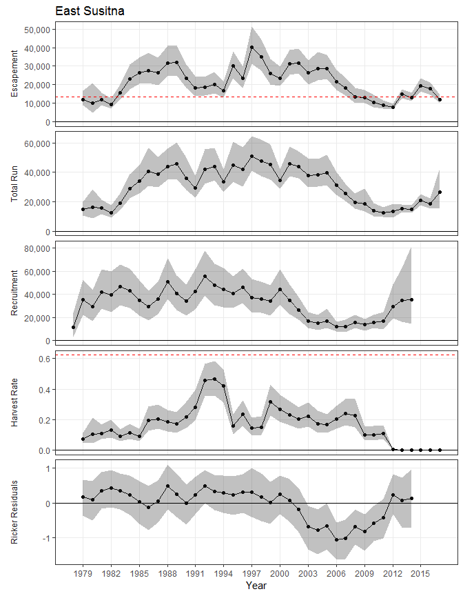
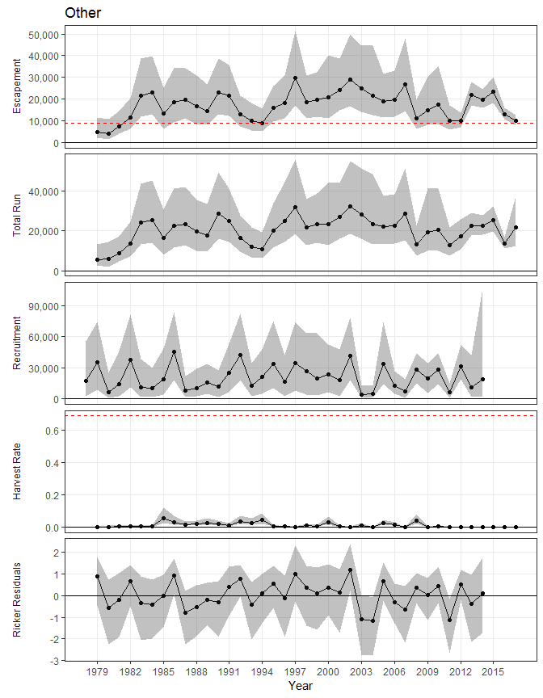
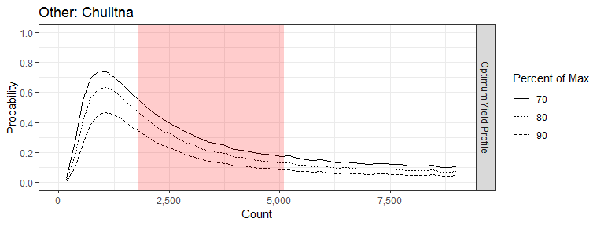

## Changes since April Meeting
  
* Separate stock-recruit analysis for 5 stocks of interest.
    + Deshka River
    + Eastside Susitna streams
    + Talkeetna drainage
    + Yentna RIver drainage
    + Other areas not listed above
* Stock specific harvest
* Separated age 3 and age 4 fish
* Added age data
    + 25 Carcass survey/fishwheel datasets
    + 64 Creel datasets
    + 15 Weir datasets
* Adjusted age comp for sample type
* Added 5 new weir counts
* Allowed stock composition to trend through time
* Possible method for developing tributary specific goals
* More informative prior for weir errors
* Improved graphics and reproducible workflow

This document focuses on the model outputs, but is short on model description. The current model can be found at (https://github.com/adamreimer/SusitnaEG/blob/develop/models/mod_SuChin.r)

## Run Reconstruction component
### Age composition
In general stock recruit parameters are not sensitive to changes in age composition but it's still worth spending some time on it since the run reconstruction estimates will likely be used independently. The data we have is from limited areas and a variety of sampling projects. Here is a look at the age data we have by sampling program. We don't have age data from all three sample types within the same year but the data we do have suggests carcass surveys and fishwheel samples are biased towards smaller fish while creel surveys are biased towards larger fish.

Figure 1.- Susitna River drainage age composition data by sampling program, 1979-2017.

  
The current model accounts for sample type before estimating annual age composition. In the middle plot you see the data and the estimates don't line up early in the time series.  These represent years where our sample may be biasing our idea of historic composition. Even after adjusting for sample type the trends in age-at-maturity, smaller contributions form older fish late in the time series, are maintained.  

Figure 8.- Estimated age-at-maturity proportions by brood year (top), age composition proportions by calendar year (middle), and total run by age (bottom), from the state-space model fitted to data from Susitna River Chinook salmon. Top and middle are area graphs, in which distance between lines represent age proportions. Dots in middle plot are data-based estimates of age composition.

  
Adjusting composition estimates for sample type increases historic estimates of age 4 and age 5 composition while decreasing historic estimates of age 6+ composition.

Figure 9.- Estimated age composition proportions by calendar year from the state-space model fitted to data from Susitna River Chinook salmon with and without correcting for bias associated with the sampling program.

### Stock Composition
The model give estimates of the composition for each stock of interest. Composition is estimated directly from radio tag data and indirectly from aerial survey data. Stock composition estimates are allowed to trend through time (For example, the composition of Willow/Deception fish increases through the time series).  

Figure 10.- Estimated stock composition proportions by year from state-space model fitted to data from Susitna River Chinook salmon.

### Aerial Survey Detectability
We are currently modeling constant detectability through time for each tributary flown. The model cannot distinguish variability in detectability from variability in abundance so to improve this section we will need to find a good covariate. I’m not sure this sort of data has been collected consistently and if it has it does not seem like it’s been tabulated.  We have a few cases we have empirical data (weir and survey data for the same tributary in the same year) regarding detectability and those values tend to straddle the mean annual estimate. A great exercise would be for the survey observers to compare this graph to their gut feeling regarding detectability in each tributary (Consider factors like visibility, geographic coverage, temporal duration of the spawning events, exc.).  Bonus points for forming opinions (perhaps a ranking) prior to looking at the figure.

Figure 11.- Estimated detectability by tributary from state-space model fitted to data from Susitna River Chinook salmon. Dots are data-based estimates of detectability. Note that the Cache Creek line is obscured by Peters Creek line  in the Yenta Drainage pane.

### Model fits
#### Deshka River
Estimates of stock composition and detectability relate aerial survey counts to the spawning abundances estimated by the stock recruit relationship. At the last meeting I was confident Deshka would be the easiest individual SR model to fit.  Turns out that we only have good knowledge about half of the time series because Deshka surveys are variable.

Figure 2.- Escapement and Inriver run abundance (black lines show the median while shaded areas show 95% credibility intervals) of Deshka River Chinook salmon as reconstructed from aerial survey counts, weir counts, and capture-recapture estimates. For plotting, aerial survey counts were expanded by the inverse of the survey detectability. Points are jittered along the x-axis.

#### East Susitna Tributaries
In contrast, for East Susitna we have 5 years of weir data and several high quality surveys (Kashwitna and Sheep not withstanding). Recalling the stock composition plots we also have great coverage in that we have flight data for most of the area.

Figure 3.- Escapement and Inriver run abundance (black lines show the median while shaded areas show 95% credibility intervals) of East Susitna Chinook salmon as reconstructed from aerial survey counts, weir counts, and capture-recapture estimates. For plotting, aerial survey counts were expanded by the inverse of the product of survey detectability and stock compostion while weir counts were expanded by the inverse of stock composition. Points are jittered along the x-axis.

#### Talkeetna Drainage
Talkeetna only has two surveys, but they track each other very well and include about 66% of the spawning area.

Figure 4.- Escapement and Inriver run abundance (black lines show the median while shaded areas show 95% credibility intervals) of Talketna Drainage Chinook salmon as reconstructed from aerial survey counts and capture-recapture estimates. For plotting, aerial survey counts were expanded by the inverse of the product of survey detectability and stock compostion. Points are jittered along the x-axis.

#### Yentna Drainage
For Yentna we have 4 surveys, two of which are high quality.

Figure 5.- Escapement and Inriver run abundance (black lines show the median while shaded areas show 95% credibility intervals) of Yentna Drainage Chinook salmon as reconstructed from aerial survey counts and capture-recapture estimates. For plotting, aerial survey counts were expanded by the inverse of the product of survey detectability and stock compostion. Points are jittered along the x-axis.

#### Other Areas
It's questionable whether we should even look at the other stock group as no one expressed interest in it and our data is limited and of poor quality.

Figure 6.- Escapement and Inriver run abundance (black lines show the median while shaded areas show 95% credibility intervals) of Other Chinook salmon as reconstructed from aerial survey counts and capture-recapture estimates. For plotting, aerial survey counts were expanded by the inverse of the product of survey detectability and stock compostion. Points are jittered along the x-axis.

We can quantify the model fit for each aerial survey by comparing errors associated with assumed relationship between spawning abundance and the aerial survey count. You can think of these numbers of Coefficients of Variation. The mean error is (0.3192654).  

Table 1.- Aerial Survey standard deviation and 90% confidence interval for each tributary in the Susitna River drainage.

Tributary       $\sigma_{weir}$(90% CI) 
--------------  ------------------------
Deshka          0.31 (0.21 - 0.48)      
Goose           0.24 (0.03 - 0.44)      
Kashwitna       0.49 (0.38 - 0.63)      
Little Willow   0.23 (0.10 - 0.33)      
Montana         0.18 (0.04 - 0.29)      
Sheep           0.46 (0.28 - 0.65)      
Willow          0.18 (0.09 - 0.28)      
Clear           0.09 (8.1e-03 - 0.24)   
Prarie          0.11 (0.01 - 0.23)      
Cache           0.81 (0.51 - 1.13)      
Lake            0.20 (0.08 - 0.31)      
Peters          0.60 (0.41 - 0.82)      
Talachulitna    0.28 (0.19 - 0.39)      
Chulitna        0.57 (0.43 - 0.78)      
Indian          0.22 (0.05 - 0.37)      
Portage         0.42 (0.29 - 0.57)      

## Stock-Recruit relationships
### Horsetail plots
Note that the axis ranges on these horsetail plots are different for each stock.

Figure 12.- Plausible spawner-recruit relationships for Deshka River Chinook salmon, as derived from an age-structured state-space model fitted to abundance, harvest, and age data for 1979-2017. Posterior medians of R and S are plotted as brood year labels with 90% credibility intervals plotted as light dashed lines. The heavy dashed line is the Ricker relationship constructed from ln($\alpha$) and $\beta$ posterior medians. Ricker relationships are also plotted (light grey lines) for 40 paired values of ln($\alpha$) and $\beta$ sampled from the posterior probability distribution, representing plausible Ricker relationships that could have generated the observed data. Recruits replace spawners (R = S) on the diagonal line.

Figure 13.- Plausible spawner-recruit relationships for East Sustina Chinook salmon, as derived from an age-structured state-space model fitted to abundance, harvest, and age data for 1979-2017. Posterior medians of R and S are plotted as brood year labels with 90% credibility intervals plotted as light dashed lines. The heavy dashed line is the Ricker relationship constructed from ln($\alpha$) and $\beta$ posterior medians. Ricker relationships are also plotted (light grey lines) for 40 paired values of ln($\alpha$) and $\beta$ sampled from the posterior probability distribution, representing plausible Ricker relationships that could have generated the observed data. Recruits replace spawners (R = S) on the diagonal line.

Figure 14.- Plausible spawner-recruit relationships for Talkeetna Drainage Chinook salmon, as derived from an age-structured state-space model fitted to abundance, harvest, and age data for 1979-2017. Posterior medians of R and S are plotted as brood year labels with 90% credibility intervals plotted as light dashed lines. The heavy dashed line is the Ricker relationship constructed from ln($\alpha$) and $\beta$ posterior medians. Ricker relationships are also plotted (light grey lines) for 40 paired values of ln($\alpha$) and $\beta$ sampled from the posterior probability distribution, representing plausible Ricker relationships that could have generated the observed data. Recruits replace spawners (R = S) on the diagonal line.

Figure 15.- Plausible spawner-recruit relationships for Yentan Drainage Chinook salmon, as derived from an age-structured state-space model fitted to abundance, harvest, and age data for 1979-2017. Posterior medians of R and S are plotted as brood year labels with 90% credibility intervals plotted as light dashed lines. The heavy dashed line is the Ricker relationship constructed from ln($\alpha$) and $\beta$ posterior medians. Ricker relationships are also plotted (light grey lines) for 40 paired values of ln($\alpha$) and $\beta$ sampled from the posterior probability distribution, representing plausible Ricker relationships that could have generated the observed data. Recruits replace spawners (R = S) on the diagonal line.

Figure 16.- Plausible spawner-recruit relationships for Other Chinook salmon, as derived from an age-structured state-space model fitted to abundance, harvest, and age data for 1979-2017. Posterior medians of R and S are plotted as brood year labels with 90% credibility intervals plotted as light dashed lines. The heavy dashed line is the Ricker relationship constructed from ln($\alpha$) and $\beta$ posterior medians. Ricker relationships are also plotted (light grey lines) for 40 paired values of ln($\alpha$) and $\beta$ sampled from the posterior probability distribution, representing plausible Ricker relationships that could have generated the observed data. Recruits replace spawners (R = S) on the diagonal line.

### State Varible Plots
Note that the y-axis ranges on these plots are different for each stock.

Figure 19.- Point estimates (posterior medians; solid lines) and 95% credibility intervals (shaded areas) of spawning escapement, total run abundance, recruitment by brood year, harvest rate, and Ricker productivity residuals from a state-space model of Deshka River Chinook salmon, 1979-2017. Posterior medians of $S_{MSY}$ and $U_{MSY}$ are plotted as short dash horizontal reference lines.

Figure 20.- Point estimates (posterior medians; solid lines) and 95% credibility intervals (shaded areas) of spawning escapement, total run abundance, recruitment by brood year, harvest rate, and Ricker productivity residuals from a state-space model of East Susitna Chinook salmon, 1979-2017. Posterior medians of $S_{MSY}$ and $U_{MSY}$ are plotted as short dash horizontal reference lines.

Figure 21.- Point estimates (posterior medians; solid lines) and 95% credibility intervals (shaded areas) of spawning escapement, total run abundance, recruitment by brood year, harvest rate, and Ricker productivity residuals from a state-space model of Talketeetna Drainage Chinook salmon, 1979-2017. Posterior medians of $S_{MSY}$ and $U_{MSY}$ are plotted as short dash horizontal reference lines.

Figure 22.- Point estimates (posterior medians; solid lines) and 95% credibility intervals (shaded areas) of spawning escapement, total run abundance, recruitment by brood year, harvest rate, and Ricker productivity residuals from a state-space model of Yentan Drainage Chinook salmon, 1979-2017. Posterior medians of $S_{MSY}$ and $U_{MSY}$ are plotted as short dash horizontal reference lines.

Figure 23.- Point estimates (posterior medians; solid lines) and 95% credibility intervals (shaded areas) of spawning escapement, total run abundance, recruitment by brood year, harvest rate, and Ricker productivity residuals from a state-space model of Other Chinook salmon, 1979-2017. Posterior medians of $S_{MSY}$ and $U_{MSY}$ are plotted as short dash horizontal reference lines.

### State-space model parameter estimates  
Table 2.- State-space model parameter estimates for Susitna River Chinook salmon, calendar years 1979-2017. Posterior medians are point estimates while coefficents of variation are shown in parentheses. Parameter definitions are in the Methods section.  

Parameter         Deshka           East Susitna     Talkeetna        Yentna           Other          
----------------  ---------------  ---------------  ---------------  ---------------  ---------------
ln($\alpha$)      1.50 (0.17)      1.47 (0.15)      1.44 (0.16)      1.51 (0.14)      1.47 (0.18)    
$\beta$           5.3e-05 (0.21)   4.6e-05 (0.24)   6.6e-05 (0.25)   4.1e-05 (0.22)   7.9e-05 (0.28) 
$\phi$            0.36 (0.66)      0.71 (0.26)      0.25 (1.18)      0.48 (0.50)      -9.1e-02 (3.0) 
$\sigma_{w}$      0.69 (0.21)      0.34 (0.30)      0.65 (0.28)      0.34 (0.29)      0.84 (0.28)    
$\sigma_{weir}$   0.10 (0.07)      NA               NA               NA               NA             
$D_{age}$         32.5 (0.17)      NA               NA               NA               NA             
$D_{comp}$        NA               144 (0.54)       36.3 (0.32)      64.4 (0.66)      199 (0.62)     
$S_{MSR}$         19,030 (0.22)    21,787 (0.26)    15,216 (0.26)    24,135 (0.21)    12,600 (0.28)  
$S_{EQ}$          34,432 (0.17)    34,701 (0.22)    25,661 (0.20)    38,454 (0.16)    23,532 (0.24)  
$S_{MSY}$         12,775 (0.17)    13,401 (0.22)    9,766 (0.20)     14,879 (0.16)    8,661 (0.24)   
$U_{MSY}$         0.68 (0.35)      0.62 (0.52)      0.65 (0.11)      0.62 (0.09)      0.69 (0.11)    

### Optimum Yield Profiles
The standard procedure at this point would be to use Optimum Yield profiles to select a goal for each stock. The profiles show the probability of reaching some percentage of maximum sustained yield at various escapement levels. Lines that spend a lot of time near 1 indicate a fairly high level of information about the yield relationship. This approach will work for the Deshka River.  

Figure 24.- Optimal yield profiles for Susitana River Chinook salmon. OYPs show probability that a specified spawning abundance will result in specified fractions (70%, 80%, and 90% line) of maximum sustained yield. Shaded areas bracket the existing goal range; grey and black marks along the x-axis show comparable lower and upper bounds for other Alaskan Chinook salmon stocks scaled by $S_{MSY}$ ratios (see Methods).

  
For the other stocks we assess the goal using aerial count data that only indexes escapement because true abundance is masked by variability in detectability and stock composition. One way to set a goal in for these stocks would be change the Optimum Yield profile to express probabilities of reaching some fraction of maximum sustained yield at various count levels. We expect these profiles to contain less information (lines farther from 1) because there is variability in detectability, stock composition and the relationship between counts and spawners. Tributaries with highly variable counts (Table 1), low contributions to the stock composition (Figure 10), or highly variable detectability (need to update) should contain less information.  
  
I’m still developing this idea, so I expect to refine or replace it after collaboration and review, but I wanted to get these graphs out there to see if this is a direction worth pursuing. I’ve included graphs for all the tributaries for which we currently have goals but some of the graphs have very little information.  
  
#### East Susitna

Figure 25.- Optimal yield profile for the East Susitna stock group as assessed using Goose Creek aerial survey data. OYPs show probability that a specified aerial count will result in specified fractions (70%, 80%, and 90% line) of maximum sustained yield. Shaded areas bracket the existing goal range.

Figure 26.- Optimal yield profile for the East Susitna stock group as assessed using Little Willow Creek aerial survey data. OYPs show probability that a specified aerial count will result in specified fractions (70%, 80%, and 90% line) of maximum sustained yield. Shaded areas bracket the existing goal range.

Figure 27.- Optimal yield profile for the East Susitna stock group as assessed using Montana Creek aerial survey data. OYPs show probability that a specified aerial count will result in specified fractions (70%, 80%, and 90% line) of maximum sustained yield. Shaded areas bracket the existing goal range.

Figure 28.- Optimal yield profile for the East Susitna stock group as assessed using Sheep Creek aerial survey data. OYPs show probability that a specified aerial count will result in specified fractions (70%, 80%, and 90% line) of maximum sustained yield. Shaded areas bracket the existing goal range.

Figure 29.- Optimal yield profile for the East Susitna stock group as assessed using Willow Creek aerial survey data. OYPs show probability that a specified aerial count will result in specified fractions (70%, 80%, and 90% line) of maximum sustained yield. Shaded areas bracket the existing goal range.

  
#### Talkeetna

Figure 30.- Optimal yield profile for the Talkeetna stock group as assessed using Clear Creek aerial survey data. OYPs show probability that a specified aerial count will result in specified fractions (70%, 80%, and 90% line) of maximum sustained yield. Shaded areas bracket the existing goal range.

Figure 31.- Optimal yield profile for the Talkeetna stock group as assessed using Prarie Creek aerial survey data. OYPs show probability that a specified aerial count will result in specified fractions (70%, 80%, and 90% line) of maximum sustained yield. Shaded areas bracket the existing goal range.

  
#### Yentna
In our April meeting some comments focused on looking at goals relative to recruitment rather than yield. For Lake Creek I’ve included recruitment and overfishing profiles along with the yield profile as a reminder that it is possible and all of the necessary outputs have already been calculated.  

Figure 32.- Optimal yield profiles (OYPs), overfishing profiles (OFPs), and optimal recruitment profiles (ORPs) for the Yentna River as assessed using Lake Creek aerial survey data. OYPs and ORPs show probability that a specified aerial count will result in specified fractions (70%, 80%, and 90% line) of maximum sustained yield or maximum recruitment. OFPs show probability that aerial counts below the specified level will result in less than specified fractions of maximum sustained yield. Shaded areas bracket the recommended goal ranges.

Figure 33.- Optimal yield profile for the Yentna River as assessed using Peters Creek aerial survey data. OYPs show probability that a specified aerial count will result in specified fractions (70%, 80%, and 90% line) of maximum sustained yield. Shaded areas bracket the existing goal range.

Figure 34.- Optimal yield profile for the Yentna River as assessed using Talachulitna River aerial survey data. OYPs show probability that a specified aerial count will result in specified fractions (70%, 80%, and 90% line) of maximum sustained yield. Shaded areas bracket the existing goal range.

  
#### Other

Figure 35.- Optimal yield profile for the Other areas as assessed using Chulitna aerial survey data. OYPs show probability that a specified aerial count will result in specified fractions (70%, 80%, and 90% line) of maximum sustained yield. Shaded areas bracket the existing goal range.

  
### Expected Sustained Yield

Figure 36.- Expected sustained yield plots for Susitna River Chinook salmon. ESY median (solid black line), and 50% interval (shaded area around the line) assume average productivity for brood years 1973-2014. The grey and black marks along the x-axis show comparable lower and upper bounds for other Alaskan Chinook salmon stocks scaled by $S_{MSY}$ ratios (see Methods).

  
## Next Steps
I need some outside input at this point so that I can fix errors and make improvements. Here is a list of things I know need work or have questions about.
  
* Input best telemetry and MR data
* Errors around theta
* Size class of IR
* Am I using the preferred stock groupings?
* Do telemetry and radio areas coincide?
* How should we handle hatchery fish in Willow/Deception
* Does Willow goal include Deception?
* Can we drop the "Other" stock?
* How do we plan to use this information to pick new goals? Are these outputs sufficient for the escapement goal review team?
